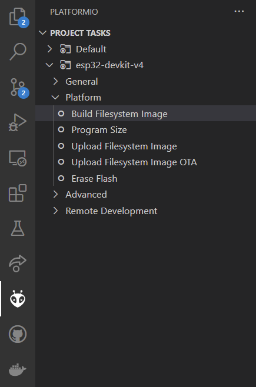

# Configuration

## Purpose

The aim of the implemented configuration is to write settings like wifi name and password to a separate configuration file instead of hard coding them in the source code. This gives the user the advantage of being able to change settings without having to change or reflash the source code. 

Actually the following settings are implemented into the config.

- wifi ssid
- wifi password
- aws url
- aws port
- mqtt subsribe topic
- mqtt publish topic
- device id
- device position
- logger level
- logger output level

## Implementation

### Create Config file

To create the configuration file the python script genreate_config.py is used. This script must be called from a command line, and the settings are then entered from the command line as well. Then a file called config_file.json is created atomatically and stored in a directory with the name data.

The created configuration file is of the type [json](https://www.w3schools.com/js/js_json_intro.asp). This format is commonly used in IoT applications for data exchange. In a json file the data is stored as text in a ordered way. This makes it easy to create, edit and read these files.

### Upload Config

On the ESP device the configuration file is stored in the [SPIFFS](esp_spiffs.md) file system together with the certificates for the ssl connection.

To uplode the configuration we suggest to use PlatformIO but you are also free to use a other option like the [Ardunio-IDE](https://randomnerdtutorials.com/install-esp32-filesystem-uploader-arduino-ide/).

**To uploade the file with PlatformIO:** 

1. Connect your ESP to your computer using a USB cable.

2. In VS Code, open the PlatformIO extension on the left side and then open the esp device folder under *PROJECT TASKS*. You should then see a view similar to the following image. 

3. Click on *Build Filesystem Image* and wait unitl the task finishes. This is indicated when SUCCESS is printed at the terminal. What happens is that the content in the top directory data is used to build a spiffs image.

4. Click on *Upload Filesystem Image*. Now the previously build image is uploaded to the flash storage of the connected ESP.

### EspConfig Class

The Esp_Config class is used on the ESP to read the configuration file from SPIFFS and to make the its contents available through get....() functions.

The class is implemented as singelton. Therefore the normal way to get an object of the class is to call getInstance() and then a object pointer will be returned.

To read the config file you have to call only once the readConfig() function of the EspConfig object.
